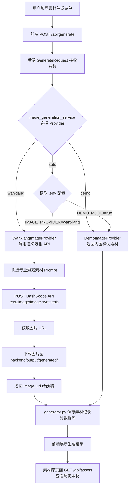

# 通义万相素材生成流程说明

本文档详细说明用户在前端点击“生成素材”后，系统如何调用通义万相 API 生成 2D 游戏素材，并最终在前端素材库中展示。

> **定位**：本项目的图像生成能力由阿里云通义万相（DashScope）提供。SpriteForge AI 负责游戏素材工作流——前端交互、Prompt 工程、图片后处理、数据库持久化、引擎导出等环节。

---

## 一、整体流程概览



---

## 二、关键文件路径一览

| 层次 | 文件 | 职责 |
|------|------|------|
| 前端 | `frontend/src/pages/AssetGenerator.tsx` | 素材生成表单 UI |
| 前端 | `frontend/src/services/api.ts` | 封装 API 请求（generateAssets, getTask） |
| 前端 | `frontend/src/types/index.ts` | TypeScript 类型定义 |
| 前端 | `frontend/src/utils/projectSettings.ts` | projectSettings localStorage 读写 |
| 前端 | `frontend/src/pages/AssetGallery.tsx` | 素材库历史页面 |
| 后端路由 | `backend/app/routers/generate.py` | `POST /api/generate` 和 `GET /api/tasks/{id}` |
| 后端模型 | `backend/app/models/schemas.py` | Pydantic 请求/响应模型 |
| 后端编排 | `backend/app/services/generator.py` | 任务生命周期管理 |
| 后端服务 | `backend/app/services/image_generation_service.py` | Provider 选择工厂 |
| 后端服务 | `backend/app/services/wanxiang_image_provider.py` | 通义万相 API 调用 |
| 后端服务 | `backend/app/services/provider_base.py` | Provider 抽象基类 |
| 后端服务 | `backend/app/services/asset_repository.py` | 素材记录 CRUD（SQLite/PostgreSQL） |
| 后端路由 | `backend/app/routers/assets.py` | `GET/DELETE /api/assets/{id}` |
| 后端配置 | `backend/app/config.py` | 环境变量读取 |
| 配置文件 | `backend/.env` | API Key、运行模式等配置 |

---

## 三、前端部分说明

### 3.1 AssetGenerator 表单字段

用户在 `AssetGenerator.tsx` 中填写以下字段：

| 字段 | 类型 | 说明 |
|------|------|------|
| `projectName` | string | 项目名称，例如 `dungeon-crawler` |
| `assetType` | `character` / `item` / `tile` / `ui` | 素材类型 |
| `prompt` | string | 用户自定义描述，例如 `a golden sword` |
| `style` | `pixel_art` / `cartoon` / `dark_fantasy` | 美术风格 |
| `size` | `32` / `64` / `128` | 像素尺寸 |
| `count` | `1` / `4` / `8` | 单次生成数量 |
| `targetEngine` | `unity` / `godot` / `generic` | 目标导出引擎 |
| `transparentBackground` | boolean | 是否透明背景 |
| `generationProvider` | `auto` / `demo` / `wanxiang` | 生成后端选择 |

### 3.2 generationProvider 三个值的含义

| 值 | 含义 | 行为 |
|---|---|---|
| `auto` | 跟随后端配置 | 读取 `.env` 中的 `DEMO_MODE` 和 `IMAGE_PROVIDER` 决定 |
| `demo` | 内置素材 | 强制使用 Demo 素材，不调用任何 AI API |
| `wanxiang` | 通义万相 | 强制调用通义万相 API 生成图片 |

### 3.3 何时选择通义万相

以下任一条件满足时，实际生成使用通义万相：

1. **用户显式选择**：表单中 `generationProvider = "wanxiang"`
2. **Auto + 后端配置**：表单中 `generationProvider = "auto"`，且后端 `.env` 中：
   - `DEMO_MODE = false`
   - `IMAGE_PROVIDER = wanxiang`
   - `DASHSCOPE_API_KEY` 已设置

### 3.4 前端请求体

`api.ts` 的 `generateAssets()` 函数将前端表单数据映射为后端 `GenerateRequest`：

```typescript
// frontend/src/services/api.ts
export function generateAssets(params: GenerateParams) {
  return request<{ task_id: string; status: string }>('/generate', {
    method: 'POST',
    body: JSON.stringify({
      project_name: params.projectName,
      asset_type: params.assetType,
      prompt: params.prompt,
      style: params.style,
      size: params.size,
      count: params.count,
      target_engine: params.targetEngine,
      transparent_background: params.transparentBackground,
      generation_provider: params.generationProvider,   // ← 关键字段
    }),
  });
}
```

### 3.5 前端展示生成结果

1. `POST /api/generate` 返回 `{ task_id, status }`
2. 前端立即调用 `GET /api/tasks/{task_id}` 获取结果
3. 在 Demo 模式下任务同步完成，`status === "ready"` 直接返回
4. 生成的素材以缩略图网格展示在结果区域
5. 如果返回了 `warning` 字段（万相 fallback），页面顶部显示琥珀色警告

### 3.6 素材库查看历史素材

1. 生成成功后，结果区域出现“查看素材库 →”链接
2. 点击跳转到 `/assets`（AssetGallery 页面）
3. AssetGallery 调用 `GET /api/assets` 获取历史素材列表
4. 支持按类型筛选（全部/角色/道具/Tile/UI）
5. 每个素材卡片显示缩略图、类型标签、像素尺寸、风格、生成时间
6. 支持下载 PNG 和删除记录

---

## 四、后端请求入口

### 4.1 generate.py 路由

```python
# backend/app/routers/generate.py

@router.post("/generate")
def create_generation(req: GenerateRequest) -> GenerateResponse:
    task_id = run_generation(req)           # 创建任务、执行生成
    task = get_task(task_id)
    return GenerateResponse(
        task_id=task_id,
        status=task["status"] if task else TaskStatus.PENDING,
    )
```

`POST /api/generate` 接收 `GenerateRequest`，返回 `GenerateResponse`（包含 `task_id` 和 `status`）。在 Demo 模式下，生成是同步完成的。

### 4.2 GenerateRequest 字段

```python
class GenerateRequest(BaseModel):
    project_name: str              # 项目名称
    asset_type: AssetType          # character | item | tile | ui
    prompt: str                    # 用户输入的描述文本
    style: ArtStyle                # pixel_art | cartoon | dark_fantasy
    size: PixelSize                # 32 | 64 | 128
    count: int                     # 生成数量（1-16）
    target_engine: EngineType      # unity | godot | generic
    transparent_background: bool   # 是否透明背景
    generation_provider: Literal["auto", "demo", "wanxiang"] = "auto"
```

`generation_provider` 是决定走哪个 Provider 的关键字段。

### 4.3 generator.py 任务生命周期

```python
def run_generation(req: GenerateRequest) -> str:
    task_id = str(uuid.uuid4())       # 生成唯一任务 ID
    _store_task(task_id)              # 存入内存 task store
    task["status"] = TaskStatus.GENERATING

    try:
        result = generate_assets(req)  # 调用 image_generation_service
    except Exception as exc:
        task["status"] = TaskStatus.FAILED
        task["error"] = str(exc)
        return task_id

    task["status"] = TaskStatus.READY
    task["assets"] = [a.model_dump() for a in result.assets]
    task["provider"] = result.provider_used
    if result.fallback_occurred and result.warning:
        task["warning"] = result.warning

    _save_assets_to_db(result.assets, req, task_id)  # 持久化到数据库
    return task_id
```

任务状态流转：`pending → generating → ready`（成功）或 `pending → generating → failed`（失败）。

`_save_assets_to_db()` 是最佳努力的数据库持久化——失败只记日志，不影响生成任务返回。

---

## 五、Provider 选择逻辑

### 5.1 架构

所有 Provider 实现同一个抽象基类：

```python
# backend/app/services/provider_base.py
class ImageGenerationProvider(ABC):
    @abstractmethod
    def generate(self, req: GenerateRequest) -> list[GeneratedAsset]: ...
    @property
    @abstractmethod
    def provider_name(self) -> str: ...
```

当前有两个具体实现：

| Provider | 类 | 说明 |
|----------|-----|------|
| Demo | `DemoImageProvider` | 返回预制的内置样例素材 |
| Wanxiang | `WanxiangImageProvider` | 调用阿里云通义万相 API |

### 5.2 选择逻辑（伪代码）

```python
# backend/app/services/image_generation_service.py

def _create_provider(generation_provider: str) -> ImageGenerationProvider:

    # 1. 用户显式选择 demo → 强制 Demo
    if generation_provider == "demo":
        return DemoImageProvider()

    # 2. 用户显式选择 wanxiang → 强制 Wanxiang
    if generation_provider == "wanxiang":
        if not _WANXIANG_AVAILABLE:
            return DemoImageProvider()  # 万相不可用时降级
        return WanxiangImageProvider()

    # 3. auto → 读取 .env 配置
    if DEMO_MODE:
        return DemoImageProvider()

    if IMAGE_PROVIDER == "wanxiang" and _WANXIANG_AVAILABLE:
        return WanxiangImageProvider()

    return ExternalImageProvider()  # 外部通用 Provider（当前为 stub）
```

### 5.3 优先级总结

1. `generation_provider = "demo"` → **Demo**（最高优先级，用户明确选择）
2. `generation_provider = "wanxiang"` → **Wanxiang**（用户明确选择）
3. `generation_provider = "auto"`：
   - `DEMO_MODE=true` → **Demo**
   - `IMAGE_PROVIDER=wanxiang` **且** `_WANXIANG_AVAILABLE` **且** `DASHSCOPE_API_KEY` 已设置 → **Wanxiang**

### 5.4 DEMO_MODE 和 IMAGE_PROVIDER 的关系

- `DEMO_MODE=true`：全局 demo 模式，忽略 `IMAGE_PROVIDER`，所有的 `auto` 请求都用 Demo
- `DEMO_MODE=false`：读取 `IMAGE_PROVIDER` 决定后端，可以是 `wanxiang` 或 `demo`

### 5.5 ALLOW_DEMO_FALLBACK 的作用

当用户请求 Wanxiang 但调用失败时：

```
if ALLOW_DEMO_FALLBACK:
    自动使用 Demo 素材，返回结果附带 metadata.warning 说明降级原因
else:
    抛出异常，任务状态变为 failed
```

---

## 六、通义万相 Provider 详细说明

### 6.1 环境变量

`wanxiang_image_provider.py` 从 `config.py` 读取以下环境变量：

| 变量 | 默认值 | 说明 |
|------|--------|------|
| `DASHSCOPE_API_KEY` | (空) | 阿里云 DashScope API Key |
| `WANXIANG_MODEL` | `wanx-v1` | 通义万相模型版本 |
| `WANXIANG_SIZE` | `1024*1024` | 生成图像尺寸 |
| `WANXIANG_N` | `1` | 单次 API 调用生成图片数量 |

### 6.2 Prompt 工程

系统不是直接把用户输入的 prompt 发给通义万相，而是包装成专业的 2D 游戏素材生成 prompt。

```python
def _build_prompt(req: GenerateRequest) -> str:
    prefix = _TYPE_PREFIX.get(req.asset_type.value, "game asset")
    type_hint = _TYPE_HINTS.get(req.asset_type.value, "")
    style_hint = _STYLE_HINTS.get(req.style.value, "")
    parts = [prefix, req.prompt, type_hint, style_hint]
    if req.transparent_background:
        parts.append("transparent background")
    return ", ".join(p for p in parts if p)
```

### 6.3 四种素材类型的 Prompt 模板

#### character（角色）

| 组成部分 | 内容 |
|----------|------|
| 类型前缀 | `game character sprite` |
| 用户输入 | 例如 `a brave knight` |
| 类型提示 | `full body, front view, centered, game asset` |
| 风格提示 | 例如 `pixel art style, crisp pixels, retro game, 16-bit` |
| 透明背景 | `transparent background`（如果勾选） |

**实际最终 prompt 示例**：
```
game character sprite, a brave knight, full body, front view, centered, game asset, pixel art style, crisp pixels, retro game, 16-bit, transparent background
```

#### item（道具）

| 组成部分 | 内容 |
|----------|------|
| 类型前缀 | `game item icon` |
| 类型提示 | `top-down view, isolated, game asset` |

**实际最终 prompt 示例**：
```
game item icon, a golden sword, top-down view, isolated, game asset, pixel art style, crisp pixels, retro game, 16-bit, transparent background
```

#### tile（地砖/地形）

| 组成部分 | 内容 |
|----------|------|
| 类型前缀 | `seamless game tile` |
| 类型提示 | `seamless, top-down, repeatable, game asset` |

Tile 类型的 prompt 特别强调 `seamless`、`repeatable`、`top-down`，因为 tile 素材需要在游戏中无缝平铺。这是与 character/item 最大的区别。

#### ui（界面元素）

| 组成部分 | 内容 |
|----------|------|
| 类型前缀 | `game UI element` |
| 类型提示 | `clean, minimal, game UI, centered` |

### 6.4 风格提示

| style 值 | 附加的 style hint |
|----------|-------------------|
| `pixel_art` | `pixel art style, crisp pixels, retro game, 16-bit` |
| `cartoon` | `cartoon style, smooth lines, vibrant colors, cel shaded` |
| `dark_fantasy` | `dark fantasy style, moody, gothic, dark colors, dramatic lighting` |

### 6.5 API 调用

```python
def _call_dashscope(self, prompt: str, size: str, n: int) -> list[str]:
    resp = requests.post(
        "https://dashscope.aliyuncs.com/api/v1/services/aigc/text2image/image-synthesis",
        headers={"Authorization": f"Bearer {DASHSCOPE_API_KEY}"},
        json={
            "model": WANXIANG_MODEL,
            "input": {"prompt": prompt},
            "parameters": {"size": size, "n": n},
        },
        timeout=120,
    )
    resp.raise_for_status()
    data = resp.json()
    return [r["url"] for r in data["output"]["results"]]
```

调用阿里云 DashScope 的 `text2image/image-synthesis` 接口，返回图片临时 URL 列表。

### 6.6 图片下载与保存

```python
def _download_image(self, url: str, asset_id: str) -> str:
    dest_dir = Path(GENERATED_DIR)   # backend/output/generated/
    dest_dir.mkdir(parents=True, exist_ok=True)
    resp = requests.get(url, timeout=60)
    filename = f"{asset_id}.png"
    dest_path = dest_dir / filename
    dest_path.write_bytes(resp.content)
    return str(dest_path)
```

图片保存路径：`backend/output/generated/{uuid}.png`

然后计算相对路径并封装为前端可访问的 URL：`/output/generated/{uuid}.png`

### 6.7 返回给前端的 Asset 对象

```python
GeneratedAsset(
    id=asset_id,             # UUID
    name=name,               # 例如 "character_32x32_1"
    type=req.asset_type,     # character | item | tile | ui
    width=req.size.value,
    height=req.size.value,
    image_url=image_url,     # 例如 "/output/generated/xxx.png"
    metadata=AssetMetadata(
        prompt=req.prompt,        # 用户原始 Prompt
        generation_mode="ai",     # "ai" 表示 AI 生成
        provider="wanxiang",      # 标注来源于通义万相
        model=WANXIANG_MODEL,     # 使用的模型
        final_prompt=prompt,      # 实际发给 API 的完整 Prompt
    ),
)
```

---

## 七、图片保存和访问路径

### 7.1 路径说明

```
通义万相 API 返回临时 URL
        ↓
后端下载至:  backend/output/generated/{uuid}.png
        ↓
封装为前端 URL: /output/generated/{uuid}.png
        ↓
前端通过  加载
```

### 7.2 后端静态文件挂载

```python
# backend/app/main.py
app.mount("/output", StaticFiles(directory=OUTPUT_DIR), name="output")
```

`OUTPUT_DIR` 指向 `backend/output/`，因此 `/output/generated/xxx.png` 实际映射到 `backend/output/generated/xxx.png`。

### 7.3 前端开发环境代理

```typescript
// frontend/vite.config.ts
server: {
  proxy: {
    '/output': 'http://127.0.0.1:8001',
  }
}
```

Vite 开发服务器将 `/output` 请求转发到后端 `8001` 端口。

### 7.4 常见图片路径错误

| 错误拼接 | 正确路径 |
|----------|----------|
| `/api/output/xxx.png` ❌ | `/output/xxx.png` ✅ |
| 原因：`/output` 是独立的静态路由，不在 `/api` 前缀下 |

`getAssetUrl()` 工具函数（`frontend/src/utils/assetUrl.ts`）统一处理各类 URL 格式，避免此类错误。

### 7.5 图片 404 的可能原因

1. 文件不存在 — 万相生成失败或文件下载失败
2. 数据库 `image_url` 指向旧记录 — 删除了 `output/` 目录下的文件
3. 路径不一致 — 后端保存路径和 `OUTPUT_DIR` 不一致
4. 后端未挂载 `/output` — `app.mount("/output", ...)` 未生效

---

## 八、数据库记录

### 8.1 保存时机

生成成功（`status = ready`）后，`generator.py` 在 `_save_assets_to_db()` 中将每条素材记录写入数据库。保存是**最佳努力**的——失败不影响用户看到的生成结果。

### 8.2 generated_assets 表结构

| 字段 | 类型 | 说明 |
|------|------|------|
| `id` | TEXT PK | 素材 UUID |
| `task_id` | TEXT | 所属任务 ID |
| `project_name` | TEXT | 项目名称 |
| `asset_type` | TEXT | 类型：character / item / tile / ui |
| `name` | TEXT | 素材名称，如 `character_32x32_1` |
| `prompt` | TEXT | 用户原始 Prompt |
| `style` | TEXT | 美术风格 |
| `size` | INTEGER | 像素尺寸 |
| `target_engine` | TEXT | 目标引擎 |
| `provider` | TEXT | 实际 Provider（wanxiang / demo） |
| `image_url` | TEXT | 前端可访问的图片路径 |
| `local_path` | TEXT | 本地文件绝对路径（当前为空） |
| `metadata_json` | TEXT | JSON 格式的完整 metadata |
| `created_at` | TEXT | ISO 8601 时间戳 |

> 注意：数据库保存的是图片**路径**和 metadata，不是图片二进制数据。图片文件存储在 `backend/output/generated/`。

### 8.3 /api/assets 接口

| 方法 | 路径 | 说明 |
|------|------|------|
| `GET` | `/api/assets` | 列出历史素材（支持 `asset_type`/`project_name` 筛选，支持分页） |
| `GET` | `/api/assets/{id}` | 查询单个素材详情 |
| `DELETE` | `/api/assets/{id}` | 删除记录（不删除图片文件） |

---

## 九、环境变量配置

### 9.1 backend/.env 示例

```env
DEMO_MODE=false
IMAGE_PROVIDER=wanxiang
DASHSCOPE_API_KEY=你的 DashScope API Key
WANXIANG_MODEL=wanx-v1
WANXIANG_SIZE=1024*1024
WANXIANG_N=1
ALLOW_DEMO_FALLBACK=true
```

### 9.2 重要说明

| 要点 | 说明 |
|------|------|
| .env 位置 | 必须放在 `backend/.env`，不是项目根目录 |
| 重启 | 修改 `.env` 后必须重启后端 |
| 安全 | `DASHSCOPE_API_KEY` 不能提交到 Git（`.gitignore` 已排除 `.env`） |
| 无 Key | 如果没有 API Key，可以设置 `DEMO_MODE=true` 使用内置素材 |
| Fallback | `ALLOW_DEMO_FALLBACK=true` 时，万相失败会自动回退 Demo |

---

## 十、如何验证是否真的调用了通义万相

### 验证步骤

1. 配置 `backend/.env`：
   ```env
   DEMO_MODE=false
   IMAGE_PROVIDER=wanxiang
   DASHSCOPE_API_KEY=你的 Key
   ALLOW_DEMO_FALLBACK=true
   ```

2. 启动后端：
   ```bash
   cd backend
   uvicorn app.main:app --reload --port 8001
   ```

3. 启动前端：
   ```bash
   cd frontend
   npm run dev
   ```

4. 在素材生成页（`/generator`）中：
   - 选择 `assetType = item`
   - 输入 `prompt = gold coin`
   - 选择 `style = pixel_art`
   - 选择 `generationProvider = wanxiang`
   - 点击“生成素材”

5. 检查后端日志，确认出现以下日志行：
   ```
   generate_assets: generation_provider=wanxiang ...
   generate_assets: selected_provider=wanxiang
   ```

6. 检查 `backend/output/generated/` 目录，确认出现新的 PNG 文件。

7. 检查返回结果中 metadata：
   ```json
   {
     "provider": "wanxiang",
     "generation_mode": "ai",
     "model": "wanx-v1"
   }
   ```

8. 检查素材库（`/assets`），确认卡片上的 provider 标签显示 `wanxiang`。

9. 如果返回的 `metadata.provider` 是 `"demo"` 并且 `metadata.warning` 字段存在，说明发生了 fallback——检查后端日志查找错误原因。

---

## 十一、常见问题排查

### 11.1 前端选了 wanxiang，但还是生成基础素材

| 可能原因 | 排查方向 |
|----------|----------|
| 万相失败后 fallback | 检查返回的 `metadata.warning` 字段，查看后端日志中的 fallback 记录 |
| 后端未读到 API Key | 确认 `.env` 在 `backend/` 下，`DASHSCOPE_API_KEY` 变量名正确 |
| 请求未传 `generation_provider` | 检查 `api.ts` 中 `generateAssets` 的请求体是否包含 `generation_provider: params.generationProvider` |
| `DEMO_MODE=true` 覆盖了配置 | 确认 `.env` 中 `DEMO_MODE=false` |
| Wanxiang 模块导入失败 | 后端启动时检查是否有 `ImportError` 日志 |
| 循环导入历史问题 | 确认 `provider_base.py` 存在且被正确导入 |

### 11.2 图片在素材库裂图

| 可能原因 | 排查方向 |
|----------|----------|
| image_url 路径拼接错误 | 确认使用 `getAssetUrl()` 而非 `${API_BASE}${image_url}` |
| `/output` 静态路由未挂载 | 确认 `main.py` 中有 `app.mount("/output", ...)` |
| 图片文件被删除 | 检查 `backend/output/generated/` 下文件是否存在 |
| 数据库记录指向旧文件 | 数据库记录在，但文件已清理 |
| Vite proxy 未配置 | 确认 `vite.config.ts` 中 `/output` 代理到 `localhost:8001` |

### 11.3 修改 .env 后不生效

1. 是否重启了后端？（`.env` 在启动时读取）
2. `.env` 是否在 `backend/` 目录下？（不是在项目根目录）
3. 变量名是否正确？（区分大小写）

### 11.4 后端启动时报 ModuleNotFoundError

```bash
cd backend
pip install -r requirements.txt
```

确认 `requirements.txt` 包含所需依赖：
- `requests` — HTTP 请求
- `dashscope` — 阿里云 SDK（可选，当前使用 requests 直接调用）
- `python-dotenv` — .env 文件读取
- `psycopg2-binary` — PostgreSQL 支持（可选）

### 11.5 生成的素材风格不对

- 通义万相的生成结果受 prompt 影响很大
- 确认 form 中选择的 `style` 与预期一致（pixel_art / cartoon / dark_fantasy）
- 尝试调整用户 prompt 的描述方式
- 对于 tile 素材，确认 prompt 中包含场景描述（草地、石头地、水面等）

---

## 十二、快速验证清单

- [ ] `backend/.env` 已配置 `DASHSCOPE_API_KEY`
- [ ] `DEMO_MODE=false`
- [ ] `IMAGE_PROVIDER=wanxiang`
- [ ] 后端启动无报错，日志显示 `Database: SQLite at ...` 或 `Database: PostgreSQL ...`
- [ ] 前端素材生成页选择 `generationProvider = wanxiang`
- [ ] 提交生成后，后端日志显示 `selected_provider=wanxiang`
- [ ] `backend/output/generated/` 出现新 PNG 文件
- [ ] 返回的 `metadata.provider === "wanxiang"`
- [ ] 返回的 `metadata.generation_mode === "ai"`
- [ ] 素材库页面（`/assets`）可见新生成的卡片
- [ ] 图片正常显示，不裂图
- [ ] 可下载 PNG
- [ ] 切换 `generationProvider = demo` 后，后端日志显示 `selected_provider=demo`
- [ ] `GET /api/runtime-config` 返回正确的 `provider_label` 和 `database` 信息
